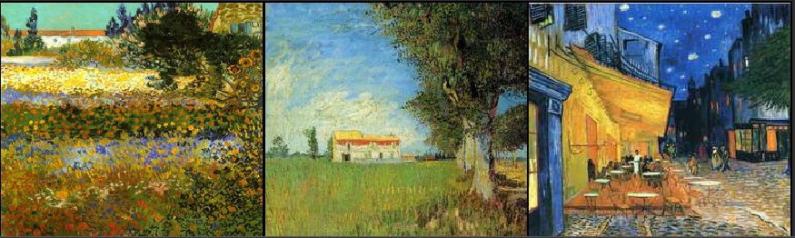

# CycleGAN-StyleTransfer

This repository contains an implementation of a CycleGAN model from scratch in PyTorch. The model was trained on the Van Gogh to image dataset for 44 epochs, effectively transferring Van Gogh's artistic style to real-world images and vice versa.

## Project Overview

CycleGAN is a generative adversarial network that learns to translate images from one domain to another without paired examples. This project demonstrates the successful translation between Van Gogh's style and another image domain.

## Results

### Real Images to Van Gogh Style

#### Real images


#### Generated Van Gogh style


*Figure: Real-world images translated to Van Gogh's artistic style.*

### Van Gogh Style to Real Images

#### Van Gogh Style Images



#### Generated Real Images


*Figure: Images in Van Gogh's style translated back to realistic images.*

## Installation

Clone the repository:

```bash
git clone https://github.com/Mo-Ouail-Ocf/CycleGAN-StyleTransfer
cd CycleGAN-StyleTransfer
```

Set up the conda environment:

```bash
conda env create -f env.yml
conda activate cycle_gan_env
```

## Usage

### Training the Model

To train the CycleGAN model, simply run the `train.py` script:

```bash
python train.py
```

### Viewing Training Logs

The training dynamics, including loss curves and other metrics, are logged in the `cycle_gan_log` directory. To visualize the logs, launch TensorBoard:

```bash
tensorboard --logdir cycle_gan_log
```

## Dataset

The model was trained on the Van Gogh to image dataset. You can download the dataset from [this link](https://www.kaggle.com/datasets/suyashdamle/cyclegan).

## Model Architecture

The CycleGAN model consists of two generator networks and two discriminator networks, following the architecture described in the original paper. The generators handle the image translation between domains, while the discriminators aim to distinguish between real and generated images.

## Reference  

This project was inspired by the [CycleGAN paper](https://arxiv.org/abs/1703.10593) and implemented entirely from scratch in PyTorch.